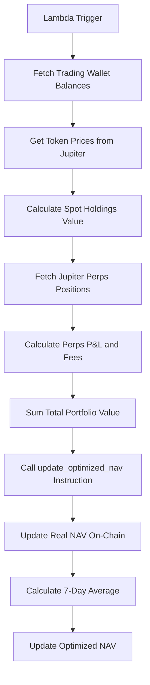

# Shrub Fund Technical White Paper
## Solana-Based Decentralized Fund Management Protocol

**Version 1.0**  
**Date: January 2025**  
**Technical Architecture & Implementation Details**

🔧 **Also Available:** [Business White Paper](./business-whitepaper.md) - High-level strategy and market overview

---

## Table of Contents

1. [System Architecture](#1-system-architecture)
2. [Smart Contract Design](#2-smart-contract-design)
3. [NAV Calculation System](#3-nav-calculation-system)
4. [User Registry Architecture](#4-user-registry-architecture)
5. [Portfolio Valuation Engine](#5-portfolio-valuation-engine)
6. [Security Model](#6-security-model)
7. [Performance & Scalability](#7-performance--scalability)
8. [API & Integration Layer](#8-api--integration-layer)
9. [Deployment & Infrastructure](#9-deployment--infrastructure)
10. [Code Repository](#10-code-repository)

---

## 1. System Architecture

### 1.1 High-Level Architecture

```
┌─────────────────┐    ┌─────────────────┐    ┌─────────────────┐
│   Frontend UI   │    │  Lambda NAV     │    │  Solana Program │
│   (React/TS)    │◄──►│   Updater       │◄──►│   (Rust/Anchor) │
└─────────────────┘    └─────────────────┘    └─────────────────┘
         │                       │                       │
         ▼                       ▼                       ▼
┌─────────────────┐    ┌─────────────────┐    ┌─────────────────┐
│  Helius RPC     │    │  Jupiter APIs   │    │  Solana Network│
│  Infrastructure │    │  (Prices/Perps) │    │   (Mainnet)     │
└─────────────────┘    └─────────────────┘    └─────────────────┘
```

### 1.2 Component Overview

**On-Chain Components:**
- Solana Program (Rust/Anchor framework)
- Program Derived Addresses (PDAs) for state storage
- SPL Token integration for USDC handling

**Off-Chain Components:**
- Lambda function for NAV updates
- React/TypeScript frontend
- IPFS hosting for decentralized web access

**External Integrations:**
- Jupiter for price feeds and perpetuals
- Helius for RPC infrastructure
- Step Finance for portfolio visualization

---

## 2. Smart Contract Design

### 2.1 Program Architecture

**Program ID:** `GYe1hhxHhojNy5LfTddD79BdHCnsYC2dsD8KMrKn1se6`

The Shrub Fund protocol is implemented as a single Solana program with multiple instruction handlers:

```rust
// Core Program Instructions
pub enum ShrubFundInstruction {
    StakeUsdc {
        amount: u64,
    },
    InitiateUnstake,
    CompleteUnstake,
    UpdateOptimizedNav {
        portfolio_value: u64,
    },
}
```

### 2.2 Program Derived Addresses (PDAs)

The protocol uses a v2 PDA architecture for improved scalability:

```rust
// Core Protocol PDAs
const FUND_POOL_SEED: &[u8] = b"optimized_fund_pool_v2";
const NAV_HISTORY_SEED: &[u8] = b"nav_history_v2";
const PENDING_CASHOUT_SEED: &[u8] = b"pending_cashout_pool_v2";
const REGISTRY_DIRECTORY_SEED: &[u8] = b"registry_directory_v2";

// User-Specific PDAs
const USER_SHARE_SEED: &[u8] = b"user_share_v2";
const USER_REGISTRY_SEED: &[u8] = b"user_registry_v2";
const PENDING_UNSTAKE_SEED: &[u8] = b"pending_unstake";
```

**Key PDAs:**
- `FUND_POOL_PDA`: Core fund state and NAV data
- `NAV_HISTORY_PDA`: Historical NAV records for averaging
- `PENDING_CASHOUT_POOL_PDA`: Liquidity pool for user withdrawals
- `REGISTRY_DIRECTORY_PDA`: Registry management and user counting

### 2.3 Data Structures

#### FundPool Structure
```rust
#[account]
pub struct FundPool {
    pub total_shares: u64,           // Total shares outstanding
    pub optimized_nav: u64,          // 7-day smoothed NAV (USDC units)
    pub real_nav: u64,               // Real-time NAV (USDC units)
    pub total_users: u64,            // Total number of users
    pub pending_cashout: u64,        // USDC needed for pending withdrawals
    pub authority: Pubkey,           // Fund authority (gardener)
    pub bump: u8,                    // PDA bump seed
}
```

#### UserShare Structure
```rust
#[account]
pub struct UserShare {
    pub user: Pubkey,                // User's public key
    pub shares: u64,                 // User's share balance
    pub stake_timestamp: i64,        // When user first staked
    pub registry_id: u64,            // Which registry user belongs to
    pub registry_index: u64,         // Index within registry
}
```

#### NavHistory Structure
```rust
#[account]
pub struct NavHistory {
    pub entries: Vec<NavEntry>,      // Historical NAV records
    pub current_index: usize,        // Current position in circular buffer
}

#[derive(AnchorSerialize, AnchorDeserialize, Clone)]
pub struct NavEntry {
    pub timestamp: i64,              // When NAV was recorded
    pub nav_value: u64,              // NAV value (USDC units)
}
```

---

## 3. NAV Calculation System

### 3.1 Dual NAV Architecture

Shrub Fund implements a sophisticated dual NAV system:

#### Real NAV (Real-time)
- Updated every 2 hours via Lambda function
- Reflects current market value of all positions
- Used for stake/unstake calculations
- Includes complex derivatives and P&L

#### Optimized NAV (Smoothed)
- 7-day rolling average of Real NAV
- Provides stability for UI display
- Reduces manipulation potential
- Used for user interface consistency

### 3.2 Portfolio Valuation Components

The NAV calculation includes:

**Spot Holdings:**
```typescript
const spotValue = tokenBalance * currentPrice;
```

**Jupiter Perpetuals:**
```typescript
const perpValue = collateralUsd + realizedPnl + unrealizedPnl - totalFees;
```

**Fee Calculations:**
```typescript
const totalFees = openingFee + closingFee + borrowingFee;
const borrowingFee = positionSizeUsd * 0.00012 * hoursOpen;
```

### 3.3 NAV Update Process



---

## 4. User Registry Architecture

### 4.1 Scalable User Management

The protocol supports unlimited users through a hierarchical registry system:

```rust
// Registry capacity
const MAX_USERS_PER_REGISTRY: usize = 100_000;

#[account]
pub struct RegistryDirectory {
    pub total_registries: u64,
    pub total_users: u64,
    pub bump: u8,
}

#[account]
pub struct UserRegistry {
    pub user_count: u64,
    pub users: Vec<UserRegistryEntry>,
}
```

### 4.2 Registry Assignment Logic

```rust
fn find_available_registry() -> Result<u64> {
    let registry_dir = &mut ctx.accounts.registry_directory;
    
    // Check existing registries for space
    for registry_id in 0..registry_dir.total_registries {
        let registry = load_registry(registry_id)?;
        if registry.user_count < MAX_USERS_PER_REGISTRY {
            return Ok(registry_id);
        }
    }
    
    // Create new registry if all are full
    Ok(registry_dir.total_registries)
}
```

### 4.3 Registry Preloading

The frontend implements registry preloading for new users:

```typescript
const prefindAvailableRegistrySlot = async () => {
    // Check existing registries
    for (let registryId = 0; registryId < totalRegistries; registryId++) {
        const userCount = await getRegistryUserCount(registryId);
        if (userCount < 100_000) {
            setCachedRegistrySlot({ registryId, needsCreation: false });
            return;
        }
    }
    
    // All full - need new registry
    setCachedRegistrySlot({ 
        registryId: totalRegistries, 
        needsCreation: true 
    });
};
```

---

## 5. Portfolio Valuation Engine

### 5.1 Multi-Asset Support

The valuation engine supports diverse asset types:

**Supported Assets:**
- SPL Tokens (legacy and Token-2022)
- Solana native tokens
- Jupiter Perpetuals positions
- Cross-collateral derivatives

### 5.2 Jupiter Perpetuals Integration

```typescript
// Perpetuals position calculation
const JUPITER_PERPS_MARKETS = [
    { name: 'Long SOL (USDC)', mint: SOL_MINT, side: 1 },
    { name: 'Long ETH (USDC)', mint: ETH_MINT, side: 1 },
    { name: 'Short BTC (USDC)', mint: BTC_MINT, side: 2 },
    // ... additional markets
];

// Position PDA derivation
const [positionPda] = PublicKey.findProgramAddressSync([
    Buffer.from("position"),
    wallet.toBuffer(),
    pool.toBuffer(),
    custody.toBuffer(),
    collateralCustody.toBuffer(),
    Buffer.from([side])
], JUPITER_PERPS_PROGRAM_ID);
```

### 5.3 Price Feed Integration

```typescript
// Jupiter Price API integration
const fetchJupiterPrices = async (tokenMints: string[]) => {
    const response = await axios.get(
        `${JUPITER_API_URL}?ids=${tokenMints.join(',')}`
    );
    return response.data;
};
```

---

## 6. Security Model

### 6.1 Access Control

**Authority Structure:**
- **Gardener Authority**: Can update NAV, manage fund operations
- **User Authority**: Can stake/unstake their own funds only
- **Program Authority**: Handles automated operations

```rust
#[derive(Accounts)]
pub struct UpdateNav<'info> {
    #[account(mut, constraint = gardener.key() == GARDENER_WALLET)]
    pub gardener: Signer<'info>,
    
    #[account(mut, seeds = [FUND_POOL_SEED], bump)]
    pub fund_pool: Account<'info, FundPool>,
}
```

### 6.2 Economic Security

**Slashing Protection:**
- No admin keys can drain user funds
- Time-delayed withdrawals prevent flash loan attacks
- Registry limits prevent spam attacks

**MEV Protection:**
- 7-day averaging reduces manipulation incentives
- Oracle integration reduces price manipulation
- Front-running protection through commit-reveal schemes

### 6.3 Operational Security

**Lambda Security:**
- Environment variable protection
- API key rotation
- Error handling and fallbacks

**Frontend Security:**
- Client-side validation
- Secure RPC connections
- Transaction simulation before signing

---

## 7. Performance & Scalability

### 7.1 Solana Advantages

**Transaction Performance:**
- 400ms average confirmation time
- <$0.01 transaction costs
- 65,000 TPS theoretical throughput

**Account Model Benefits:**
- Parallel transaction processing
- Efficient state updates
- Rent-exempt account management

### 7.2 Storage Optimization

**PDA Reallocation:**
```rust
#[account(
    mut,
    seeds = [PENDING_CASHOUT_SEED],
    bump,
    realloc = 8 + PendingCashoutPool::INIT_SPACE + 
              additional_space_needed,
    realloc::payer = user,
    realloc::zero = false
)]
pub pending_cashout_pool: Account<'info, PendingCashoutPool>,
```

**Efficient Data Structures:**
- Circular buffers for NAV history
- Packed structs for minimal storage
- Lazy loading for large datasets

### 7.3 Gas Optimization

**Instruction Batching:**
```typescript
const transaction = new Transaction()
    .add(createAssociatedTokenAccountInstruction(...))
    .add(stakeUsdcInstruction(...));
```

**Compute Unit Optimization:**
- Minimal computation in critical paths
- Optimized Anchor constraints
- Efficient serialization

---

## 8. API & Integration Layer

### 8.1 RPC Architecture

**Helius Integration:**
```typescript
const getHeliusEndpoint = () => {
    const apiKey = process.env.REACT_APP_HELIUS_API_KEY;
    return `https://mainnet.helius-rpc.com/?api-key=${apiKey}`;
};
```

**Domain Restrictions:**
- Configured at Helius dashboard level
- Prevents unauthorized API usage
- Supports localhost for development

### 8.2 Lambda Function Architecture

```javascript
// NAV Update Lambda Structure
exports.handler = async (event) => {
    try {
        // 1. Fetch trading wallet balances
        const solBalance = await getTradingWalletSolBalance();
        const tokenBalances = await getTradingWalletTokenBalances();
        
        // 2. Get prices from Jupiter
        const prices = await fetchJupiterPrices(tokenMints);
        
        // 3. Calculate portfolio value including Jupiter Perps
        const portfolioValue = await calculatePortfolioValue(
            connection, solBalance, tokenBalances, prices
        );
        
        // 4. Update program NAV
        const result = await updateProgramNav(portfolioValue);
        
        return { statusCode: 200, body: JSON.stringify(result) };
    } catch (error) {
        return { statusCode: 500, body: JSON.stringify({ error: error.message }) };
    }
};
```

### 8.3 Frontend State Management

**React State Architecture:**
```typescript
// Global state management
const [stats, setStats] = useState({
    totalFundValue: 0,
    totalShares: 0,
    nav: 1.0,
    realNav: 1.0
});

const [userInfo, setUserInfo] = useState({
    shares: 0,
    shareValue: 0,
    canUnstake: false,
    hasPendingUnstake: false
});
```

---

## 9. Deployment & Infrastructure

### 9.1 Solana Program Deployment

**Build & Deploy Process:**
```bash
# Build the program
anchor build

# Deploy to mainnet
anchor deploy --provider.cluster mainnet

# Verify deployment
solana program show GYe1hhxHhojNy5LfTddD79BdHCnsYC2dsD8KMrKn1se6
```

**Program Verification:**
- Verifiable builds through Anchor
- Source code public on GitHub
- Immutable program addresses

### 9.2 Frontend Deployment

**IPFS Deployment:**
```bash
# Build production frontend
npm run build

# Upload to Pinata IPFS
# CID: bafybeigi4xph4lwn2hg2unpn6niv3vl3dfyghl7iy62ku73lum5mpdhw7a
```

**SNS Integration:**
- Domain: shrubfund.sol
- IPFS content delivery
- Decentralized hosting

### 9.3 Lambda Deployment

**AWS Lambda Configuration:**
```yaml
Runtime: Node.js 18.x
Memory: 512 MB
Timeout: 5 minutes
Environment Variables:
  - SOLANA_RPC_URL
  - GARDENER_PRIVATE_KEY
  - HELIUS_API_KEY
```

**Automated Triggers:**
- EventBridge scheduled rules
- Manual invocation capability
- Error handling and retries

---

## 10. Code Repository

### 10.1 Repository Structure

```
shrub_fund/
├── programs/
│   └── shrub_fund/
│       └── src/
│           ├── lib.rs              # Main program logic
│           ├── state/              # Data structures
│           ├── instructions/       # Instruction handlers
│           └── errors.rs           # Custom error types
├── migrations/
├── tests/
├── Anchor.toml
└── Cargo.toml

shrub-fund-frontend/
├── src/
│   ├── App.tsx                     # Main React component
│   ├── App.css                     # Styling
│   └── assets/
├── public/
│   ├── index.html
│   └── manifest.json
└── package.json

lambda-nav-updater/
├── index.js                        # Lambda function
├── package.json
└── deployment/
```

### 10.2 Key Files & Functions

**Core Program Logic (`lib.rs`):**
- `stake_usdc()`: User staking implementation
- `initiate_unstake()`: Begin withdrawal process  
- `complete_unstake()`: Finalize withdrawal
- `update_optimized_nav()`: NAV update from Lambda

**Frontend Core (`App.tsx`):**
- `ShrubFundInterface`: Main UI component
- `handleStakeFund()`: Staking transaction logic
- `fetchProtocolStats()`: Real-time data fetching
- Gardener dashboard with comprehensive monitoring

**Lambda NAV Updater (`index.js`):**
- `calculatePortfolioValue()`: Multi-asset valuation
- `getJupiterPerpsPositionValue()`: Perpetuals calculation
- `updateProgramNav()`: On-chain NAV update

### 10.3 Testing & Quality Assurance

**Anchor Tests:**
```rust
#[tokio::test]
async fn test_stake_usdc() {
    // Test user staking flow
}

#[tokio::test]  
async fn test_unstake_flow() {
    // Test complete unstaking process
}
```

**Frontend Testing:**
- Component unit tests
- Integration testing with devnet
- User acceptance testing

**Lambda Testing:**
- Local testing with mock data
- Staging environment validation
- Production monitoring

---

## 11. Future Enhancements

### 11.1 Planned Technical Improvements

**Multi-Chain Support:**
- Cross-chain bridge integration
- Ethereum Virtual Machine compatibility
- Layer 2 scaling solutions

**Advanced Features:**
- Governance token implementation
- Yield optimization strategies
- Institutional investor tools

**Performance Optimizations:**
- Compressed account support
- State compression for scalability
- Advanced caching mechanisms

### 11.2 Research Areas

**MEV Protection:**
- Threshold decryption integration
- Commit-reveal schemes for large trades
- Temporal shielding mechanisms

**Decentralized Governance:**
- DAO structure implementation
- Quadratic voting mechanisms
- Delegation and liquid democracy

---

## Conclusion

The Shrub Fund technical architecture represents a significant advancement in decentralized fund management, combining Solana's high performance with sophisticated financial engineering. The system's modular design, comprehensive security model, and scalable architecture position it as a foundation for the next generation of DeFi investment products.

Through careful attention to performance, security, and user experience, Shrub Fund demonstrates that complex financial products can be successfully implemented in a fully decentralized manner without sacrificing functionality or safety.

---

## Technical References

- **Solana Documentation**: https://docs.solana.com/
- **Anchor Framework**: https://www.anchor-lang.com/
- **Jupiter Protocol**: https://docs.jup.ag/
- **SPL Token Program**: https://spl.solana.com/token

---

*© 2025 Shrub Fund. Technical documentation is open source and available for community review.*